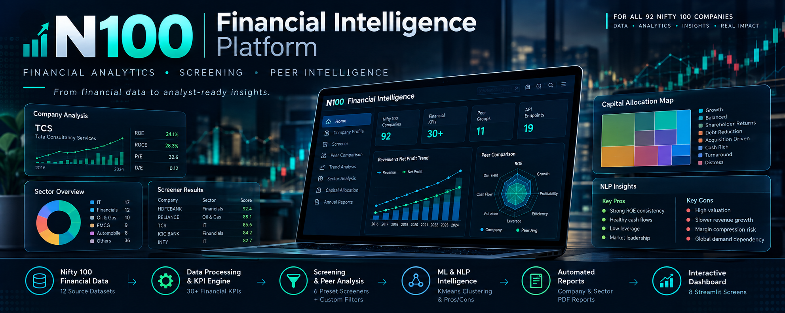
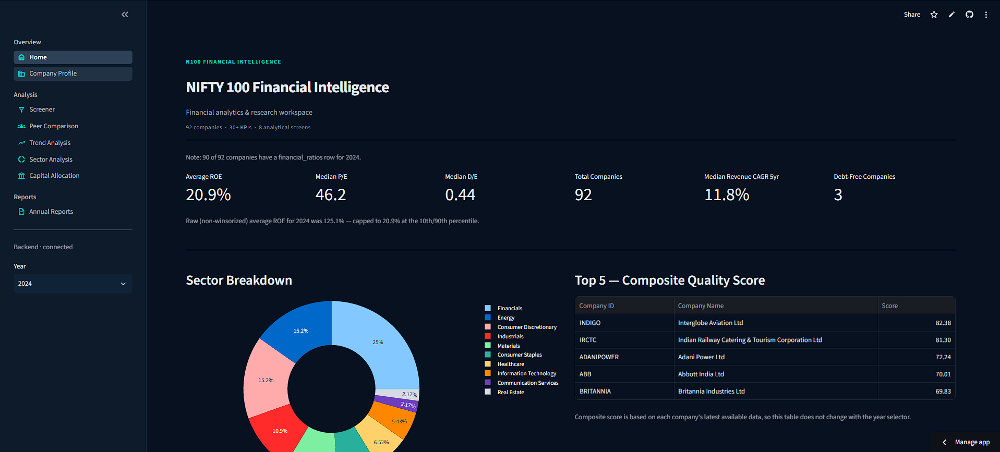
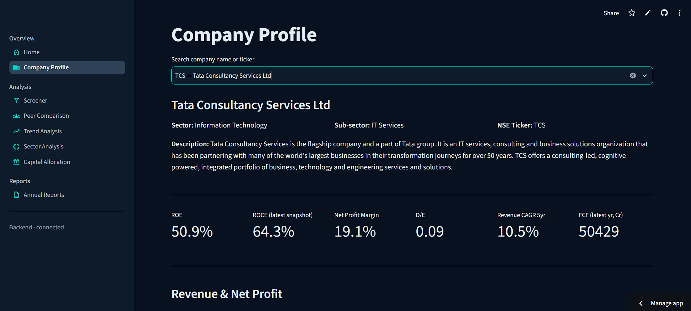
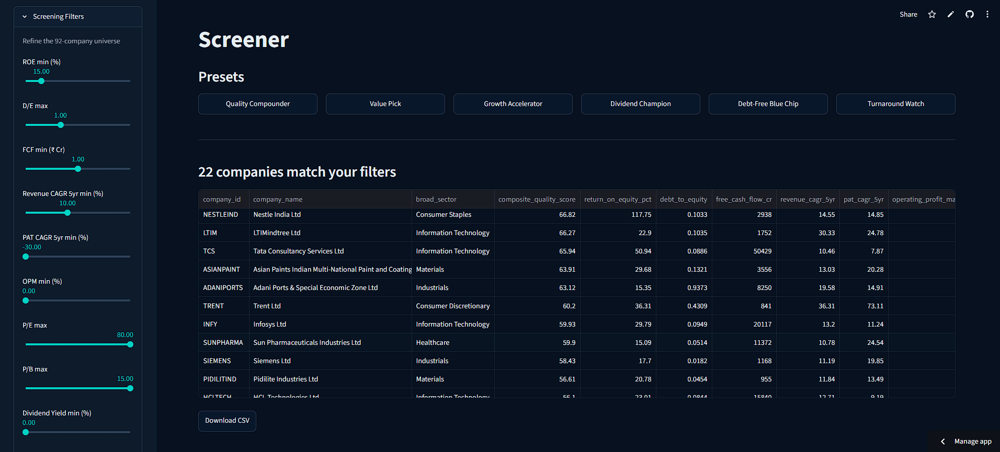
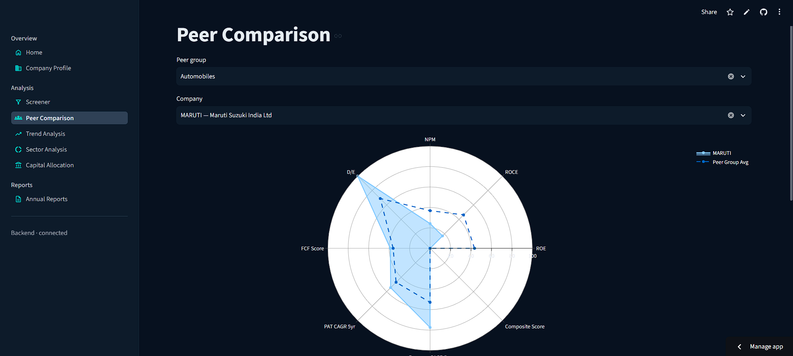
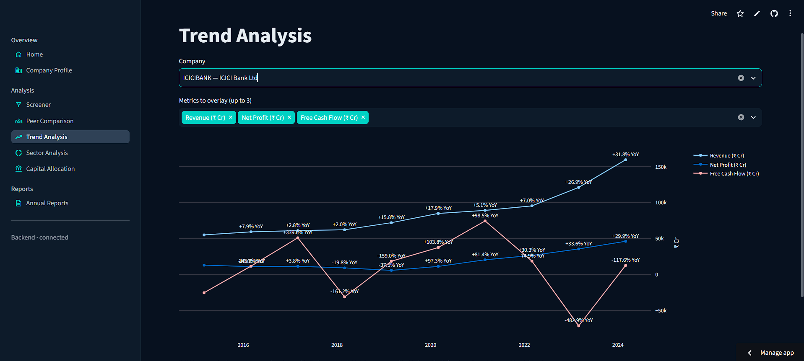
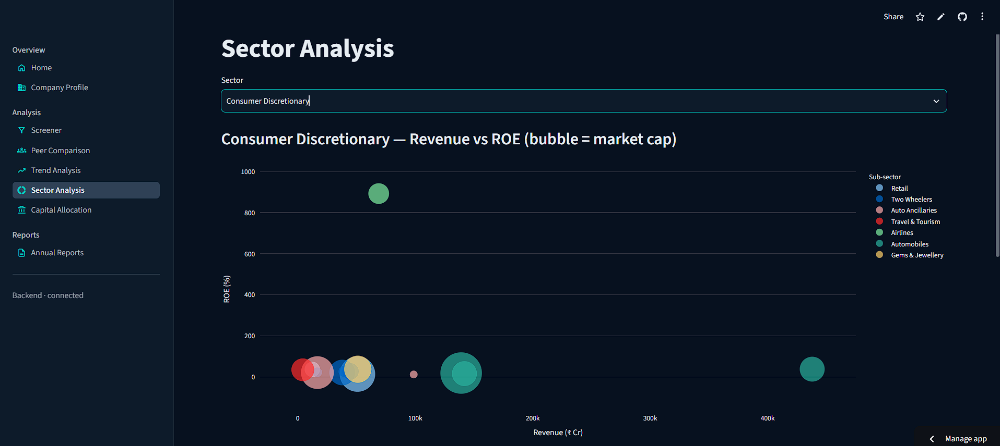
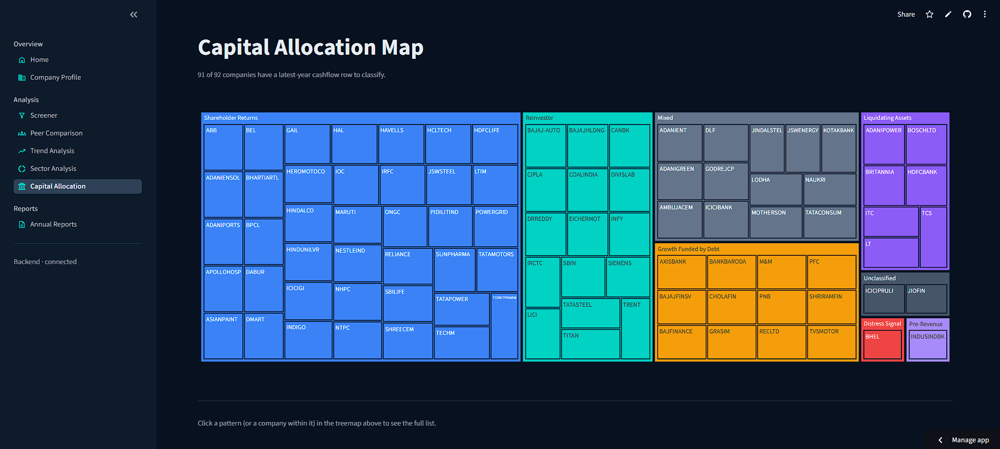
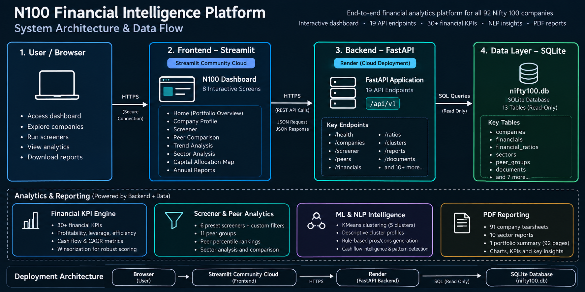

<h1> Nifty 100 Financial Intelligence</h1>

**A production-style financial analytics and research workspace for a curated 92-company subset of the Nifty 100:**<br>

 ETL pipeline, 30+ financial metrics & analytical signals, investment screener, peer benchmarking, NLP-generated pros/cons, PDF reporting, KMeans clustering, and a 19-endpoint REST API on top of an 8-screen Streamlit dashboard (cloud deployed).

<p align="center">
   <!-- Core Stack -->
  
  
  
  
  
  
  
  
   <!-- Testing / Quality -->
  
  
   <!-- Deployment -->
  
  
   <!-- License -->
  

</p>

> **Release:** `v1.0.0` -- Initial stable release

## Live Demo:

🚀 **Live app Link:** [https://nifty100-finintel.streamlit.app](https://nifty100-finintel.streamlit.app/) <br>
📡 **Swagger API Docs:** [https://n100-financial-intelligence-api-nuv0.onrender.com/docs](https://n100-financial-intelligence-api-nuv0.onrender.com/docs)<br>
🩺 **API Health:** [https://n100-financial-intelligence-api-nuv0.onrender.com/api/v1/health](https://n100-financial-intelligence-api-nuv0.onrender.com/api/v1/health)




---

## At a Glance:

| Coverage | Analytics | Application | Quality |
|---|---|---|---|
| **92 companies** | **30+ financial metrics** | **8 Streamlit screens** | **172 tests passing** |
| **13 SQLite tables** | **11 peer groups** | **19 REST endpoints** | **16 DQ rules** |
| **12 source datasets** | **6 screener presets** | **102 generated reports** | **Cloud deployed** |

> **Scope note:** the source universe contains 92 companies from the Nifty 100 dataset used for this project. The platform intentionally reports the actual available coverage rather than presenting it as a complete 100-company dataset.

---

## What This Project Does:

N100 Financial Intelligence turns structured financial data into a single analyst-style workspace. The application combines company fundamentals, screening, peer benchmarking, sector context, trend analysis, cash-flow signals, clustering, qualitative insights, and PDF reporting instead of treating each workflow as a separate notebook or script.

### Core capabilities

- **Financial analytics:** profitability, leverage, efficiency, valuation, cash flow, and CAGR metrics
- **Company intelligence:** company profiles, historical trends, KPI summaries, and generated pros/cons
- **Smart screening:** six presets plus custom multi-factor filtering across ten financial thresholds
- **Peer intelligence:** eleven peer groups with percentile-based benchmarking and radar comparison
- **Cash-flow intelligence:** CFO quality, CapEx intensity, FCF-oriented analysis, distress/deleveraging flags, and eight capital-allocation patterns
- **ML/NLP:** KMeans clustering, descriptive cluster profiling, business-description tagging, and rule-based qualitative insights
- **Reporting:** company tearsheets, sector reports, portfolio summary output, CSV/XLSX exports
- **API-first integration:** Streamlit consumes the same FastAPI service used for external API access

### Project Scope
- 92 companies · 12 source datasets (7 core + 5 supporting)
- **13-table** SQLite schema (`nifty100.db`); see [Known Data Limitations] for why this differs from the 10 originally planned
- 17 core KPI categories spanning 30+ financial metrics across profitability, leverage, efficiency, cash flow, and CAGR analysis
- 6 preset investment screeners + custom filter engine
- Auto-generated pros/cons (24 rules, confidence-scored) for all 92 companies
- Cash flow intelligence: CFO quality, CapEx intensity, distress/deleveraging flags, 8-pattern capital allocation classification
- KMeans clustering (5 clusters) with descriptive naming and outlier detection
- Peer percentile rankings across **11** peer groups 
- PDF reporting: 91 company tearsheets, 10 sector reports, 1 portfolio summary(92 pages)
- 19-endpoint REST API (FastAPI) with OpenAPI docs + Postman collection
- 8-screen Streamlit dashboard + valuation module
- 172 passing tests, 0 failures -- across ETL, KPI, DQ, screener, and API layers

### Key Findings
- 16 data quality rules enforced (not 14 as originally scoped); all CRITICAL issues resolved before load
- 172 unit/integration tests passing (100% pass rate), 100% docstring coverage (`interrogate`), 0 `ruff` findings
- Winsorization (P10/P90) applied to neutralize extreme-value artifacts in composite scoring
- Load test: 10 concurrent screener calls complete in ~1s (target: <10s); dashboard data-load timing ~3-10ms per ticker (target: <3s) -- see `output/performance_notes.md`
- Several sector-specific edge-case bugs were identified and fixed during Sprints 5–6, including leverage-based con-rules and Distress Signal logic affecting banks/NBFCs; full traceability is documented in the `docs/sprint retrospectives`.

---

## Dashboard Preview:

The live application has **8 screens** organized into Overview, Analysis, and Reports.

### 1. Home — Portfolio Overview

Portfolio-wide KPIs, sector distribution, and high-level company analytics.




### 2. Company Profile

Deep-dive into one company's profile, financial history, KPIs, trends, and generated qualitative insights.



### 3. Screener

Apply ten financial thresholds, use preset screens, inspect results, and export the filtered universe.



### 4. Peer Comparison

Benchmark a selected company against its peer group using percentile metrics, KPI tables, and radar visualization.



### 5. Trend Analysis

Overlay up to three metrics across the company's available historical period.



### 6. Sector Analysis

Explore sector medians and a Revenue-vs-ROE view for companies in the selected sector.



### 7. Capital Allocation

Explore eight capital-allocation patterns with an interactive treemap.



### 8. Annual Reports

Search companies and inspect annual-report links, with invalid/non-HTTP links surfaced by the application.

---

## System Architecture:

The deployed application follows a clear frontend → backend → data flow.

<p align="center">
  
</p>

### Runtime flow

```text
Browser
   │
   ▼
Streamlit Community Cloud
   │
   │ HTTPS / REST
   ▼
FastAPI on Render
   │
   │ SQL reads
   ▼
nifty100.db (SQLite)
```

### Layer responsibilities

| Layer | Responsibility |
|---|---|
| **Streamlit** | Navigation, filters, charts, tables, downloads, and user-facing status |
| **API client** | Frontend-to-backend HTTP boundary and connection/cold-start handling |
| **FastAPI** | REST endpoints, dashboard read models, routing, response handling |
| **Analytics** | Ratios, CAGR, cash flow, peers, clustering, sector intelligence |
| **Screener** | Ten-factor filtering, presets, and composite scoring |
| **Reports** | Company, sector, and portfolio PDF generation |
| **SQLite** | Bundled read-mostly financial dataset |
| **Tests** | ETL, KPI, DQ, screener, API, and integration coverage |

---

## API:

The current backend exposes **19 REST endpoints** under `/api/v1`.

### Live endpoints

- **Base API:** https://n100-financial-intelligence-api-nuv0.onrender.com/api/v1
- **Swagger UI:** https://n100-financial-intelligence-api-nuv0.onrender.com/docs
- **Health check:** https://n100-financial-intelligence-api-nuv0.onrender.com/api/v1/health

### Example requests

```bash
# Health
curl https://n100-financial-intelligence-api-nuv0.onrender.com/api/v1/health

# List companies
curl https://n100-financial-intelligence-api-nuv0.onrender.com/api/v1/companies

# Company profile
curl https://n100-financial-intelligence-api-nuv0.onrender.com/api/v1/companies/TCS

# Screener
curl "https://n100-financial-intelligence-api-nuv0.onrender.com/api/v1/screener?min_roe=15&max_de=1.0"

# Company tearsheet
curl https://n100-financial-intelligence-api-nuv0.onrender.com/api/v1/companies/TCS/tearsheet -o TCS_tearsheet.pdf
```

API contracts are stored under `docs/`:

- [`openapi.json`](docs/openapi.json)
- [`postman_collection.json`](docs/postman_collection.json)

---

## Data & Analytics Pipeline:

```text
Source Excel Files
       │
       ▼
┌──────────────────────┐
│ ETL / Normalization  │
└──────────┬───────────┘
           ▼
┌──────────────────────┐
│ 16 Data-Quality      │
│ Validation Rules     │
└──────────┬───────────┘
           ▼
┌──────────────────────┐
│ SQLite Data Layer    │
│ 13 tables            │
└──────────┬───────────┘
           ▼
┌──────────────────────────────────────────────┐
│ Financial KPIs · CAGR · Peer Analytics       │
│ Cash Flow · Screener · Clustering · NLP      │
└──────────┬───────────────────────────────────┘
           ▼
┌──────────────────────────────────────────────┐
│ FastAPI → Streamlit → Reports / Exports      │
└──────────────────────────────────────────────┘
```

---

## Technology Stack:

| Area | Technologies |
|---|---|
| **Language** | Python |
| **Frontend** | Streamlit |
| **Backend** | FastAPI, Uvicorn, HTTPX |
| **Data** | Pandas, NumPy, SQLite |
| **ML** | Scikit-learn / KMeans |
| **NLP** | Rule-based text processing / sentiment tooling used by the project |
| **Visualization** | Plotly, Matplotlib |
| **Reporting** | ReportLab, CSV/XLSX exports |
| **Testing** | Pytest |
| **Quality** | Ruff, Interrogate |
| **API tooling** | OpenAPI, Postman |
| **Deployment** | Streamlit Community Cloud, Render |

---

## Engineering Highlights:

### Data quality is treated as a feature

The ETL layer includes **16 explicit data-quality rules**. Data gaps found during development are documented rather than silently replaced with fabricated values.

### The dashboard and API share the same analytical contract

The Streamlit dashboard uses FastAPI as its backend boundary. This keeps the frontend independent from SQLite and makes the analytical data available both to the dashboard and to external API clients.

### Financial-sector edge cases are handled explicitly

Several calculations require context-specific treatment—for example, leverage-based screening logic for Financials and the absence of a true per-year ROCE series in the underlying data. The project documents these limitations instead of hiding them.

### Performance and usability were tested

SQLite indexing, API integration, dashboard loading, and concurrent screener behavior were tested during the final sprint. The project retains the performance notes and final acceptance artifacts under `output/` and `docs/`.

---

## Key Technical Decisions

- **FastAPI as the data boundary:** Streamlit consumes analytical data through REST endpoints instead of accessing SQLite directly, keeping the frontend separated from the database layer.
- **SQLite for the analytical read model:** A lightweight, portable database is sufficient for the project's read-heavy financial analytics workload while keeping deployment simple.
- **Sector-aware financial logic:** Financial-sector edge cases are handled explicitly where standard leverage and ROCE formulas are not directly comparable across banks, NBFCs, and non-financial companies.
- **Rule-based qualitative insights:** Pros/cons are generated from documented financial thresholds and rules, making the resulting insights traceable and auditable.

---

## Validation Snapshot:

| Check | Current result |
|---|---|
| Companies in dataset | **92** |
| SQLite tables | **13** |
| Broad sectors | **10** |
| Peer groups | **11** |
| Data-quality rules | **16** |
| REST API endpoints | **19** |
| Streamlit screens | **8** |
| Screener presets | **6** |
| Automated tests | **172 passing** |
| Company tearsheets | **91 generated** |
| Sector reports | **10 generated** |
| Portfolio summary | **92 pages** |

---

## Sprint Progress:

| Sprint | Target Story Point | EPIC | Status |
|---|---|---|---|
| **Sprint 1** | 34 SP | Data ingestion, normalization, validation, and database foundation | ✅ Complete |
| **Sprint 2** | 42 SP | Financial ratio, CAGR, and cash-flow analytics | ✅ Complete |
| **Sprint 3** | 49 SP | Screener, presets, composite scoring, and peer engine | ✅ Complete |
| **Sprint 4** | 55 SP | Streamlit dashboard, analysis screens, and valuation | ✅ Complete |
| **Sprint 5** | 70 SP | NLP-assisted insights, cash-flow intelligence, clustering, and PDF reports | ✅ Complete |
| **Sprint 6** | 89 SP | FastAPI, API integration, testing, performance, documentation, and deployment | ✅ Complete |

Detailed sprint retrospectives are available in `docs/`.

---

## Project Structure:

```text
N100_Financial_Intelligence/
│
├── assets/
│   ├── screenshots/              # Dashboard screenshots for documentation
│   ├── graph.png                 # Favicon
│   ├── hero-banner.png
│   └── sys-architect.png
│
├── config/
│   └── screener_config.yaml      # Screener thresholds and behavior
│
├── data/
│   ├── raw/                      # 12 Source datasets (local/source data)
│   └── processed/                # Cleaned/transformed data
│
├── db/
│   ├── schema.sql
│   └── nifty100.db               # 13 tables, SQLite_database
│
├── docs/
│   ├── analyst_guide.pdf
│   ├── acceptance_checklist.pdf
│   ├── openapi.json
│   ├── postman_collection.json
│   └── sprint*_Retrospective.md
│
├── notebooks/
│   └── exploratory_queries.sql
│
├── output/                        # validation_failures.csv, cluster_labels.csv,
│                                    pros_cons_generated.csv, cashflow_intelligence.xlsx,
│                                    portfolio_stats.csv, perf_notes.md,...
│
├── reports/
│   ├── portfolio/                 # portfolio_summary.pdf (92 pages)
│   ├── radar_charts/              # peer-relative + standalone PNGs
│   ├── sector/                    # 10 sector PDFs 
│   ├── tearsheets/                # 91 per-company PDFs (JIOFIN skipped, <3yrs data)
│   ├── elbow_plot.png
│   ├── correlation_heatmap.png
│   └── pytest_report.html
│
├── src/
│   ├── etl/                       # loader, validator, database_setup       [Sprint 1]
│   ├── analytics/                 # ratios, cagr, cashflow_kpis, peer,      [Sprints 2, 6]
│   │                                populate_ratios, radar_charts, clustering,
│   │                                cluster_profiling, capital_allocation_report,
│   │                                add_indexes                             
│   ├── screener/                  # engine, presets, composite_score        [Sprint 3]
│   ├── dashboard/                 # app, 8 pages, utils                     [Sprint 4]
│   ├── nlp/                       # parser, pros_cons_generator             [Sprint 5]
│   ├── reports/                   # tearsheet, sector_report,
│   │                                portfolio_summary                       [Sprint 5]
│   ├── api/                       # main, database, export_openapi,
│   │                                routers/ (8 files, 19 endpoints)        [Sprint 6]
│   ├── testing/                   # performance_tests                       [Sprint 6]
│   └── tools/                     # add_docstrings                          [Sprint 6]
│
├── tests/
│   ├── etl/
│   ├── kpi/
│   ├── dq/
│   ├── screener/
│   └── api/
│
├── .gitignore
├── .python-version
├── LICENSE
├── render.yaml
├── requirements.txt
└── README.md
```

---

## Getting Started:

### 1. Clone the repository

```bash
git clone https://github.com/Abhishek-369V/N100-financial-intelligence-platform.git
cd N100-financial-intelligence-platform
```

### 2. Create and activate a virtual environment

```bash
python -m venv venv
```

**For Windows:**

```powershell
venv\Scripts\activate
```

**For macOS / Linux:**

```bash
source venv/bin/activate
```

### 3. Install dependencies

```bash
pip install -r requirements.txt
```

### 4. Run Pipeline
```bash
python -m src.etl.data_ingestion    
python -m src.etl.database_setup
python -m src.analytics.add_indexes   
```

### 5. Start FastAPI

```bash
uvicorn src.api.main:app --port 8000 --reload
```

Open the local Swagger UI at:

```text
http://127.0.0.1:8000/docs
```

### 6. Start Streamlit

In a second terminal:

```bash
streamlit run src/dashboard/app.py
```

Run the command from the **project root** so project-relative paths resolve correctly.

---

## Environment Configuration:

The dashboard uses `N100_API_BASE_URL` to locate FastAPI.

### Local development

The default value is:

```text
http://127.0.0.1:8000/api/v1
```

### Streamlit Community Cloud

Configure the deployed API base URL through Streamlit Secrets:

```toml
N100_API_BASE_URL = "https://n100-financial-intelligence-api-nuv0.onrender.com/api/v1"
```

Do **not** commit `.streamlit/secrets.toml`.

---

## Testing:

Run the full suite with:

```bash
python -m pytest tests/ -q
```

Current validated result:

```text
172 passed
```

For the HTML audit report:

```bash
pytest tests/ --html=reports/pytest_report.html --self-contained-html -v
```

---

## Documentation:

- 📊 [`Project Presentation`](docs/N100_Project_Presentation.pptx) — PPT Overview
- 📘 [`Analyst Guide`](docs/analyst_guide.pdf) — dashboard usage, API reference, troubleshooting, and KPI glossary
- ✅ [`Acceptance Checklist`](docs/acceptance_checklist.pdf) — final acceptance gates and evidence
- 📡 [`OpenAPI Specification`](docs/openapi.json)
- 🧰 [`Postman Collection`](docs/postman_collection.json)

---

## Deployment:

### Frontend

The Streamlit application is deployed on **Streamlit Community Cloud** from:

```text
src/dashboard/app.py
```

### Backend

The FastAPI application is deployed on **Render** using [`render.yaml`](render.yaml).

### Deployment flow:

```text
GitHub
   │
   ├──────────► Streamlit Community Cloud
   │                    │
   │                    │ HTTPS
   │                    ▼
   └──────────► Render / FastAPI
                         │
                         ▼
                    nifty100.db
```

> **Free-tier behavior:** Render may sleep after inactivity. The Streamlit shell therefore distinguishes connecting, waking, connected, and unavailable backend states.

---

## Known Data Limitations:

The project deliberately documents genuine data limitations:

- **10 broad sectors, not 11:** sector labels and peer groups are separate concepts; the dataset has 10 distinct broad sectors and 11 peer groups.
- **13 tables, not 10:** the SQLite schema evolved beyond the original plan as more analytical outputs were incorporated.
- **16 DQ rules, not 14:** the final validator implements 16 checks.
- **ROCE is not a full yearly series:** `companies.roce_percentage` is a latest-year snapshot. Where a trend is shown, the platform uses a derived EBIT / Capital Employed proxy and labels it as derived.
- **Analysis-source coverage is partial:** only a subset of companies has entries in the `analysis` table.
- **Raw pros/cons coverage is partial:** the platform's generated pros/cons are derived independently from the limited raw `prosandcons` source.
- **SBIN and ATGL are absent from `financial_ratios`:** as a result, they are excluded from the screener universe while remaining represented in other areas where available data supports it.
- **Documents schema naming differs:** the `documents` table uses `Year` / `Annual_Report` rather than the lowercase convention used elsewhere.
- **JIOFIN tearsheet exception:** the company is skipped from tearsheet generation because it does not meet the project's minimum history requirement.

See the analyst guide and sprint retrospectives for the detailed rationale behind these cases.

---

## Future Enhancements

- **Real-time market data:** Integrate live price and valuation data for continuously updated market insights.
- **Containerized deployment:** Package the FastAPI backend and Streamlit frontend with Docker for more portable deployment.
- **Financial NLP models:** Extend the current rule-based/NLTK text analysis with transformer-based financial language models such as FinBERT.
- **Automated alerts:** Add scheduled notifications for screening conditions, valuation thresholds, and portfolio-monitoring events.

---

## Portfolio / Research Disclaimer:

This project is an **analytics and research demonstration**, not a source of investment advice or a recommendation to buy, sell, or hold any security. Metrics and classifications are derived from the project's dataset, formulas, rules, and documented assumptions and should be independently verified before being used for real-world decisions.

---

## License:

This project is licensed under the **MIT License**. See [`LICENSE`](LICENSE) for details.

The MIT License applies to the project's code. Third-party datasets, company information, financial-source materials, and linked reports remain subject to their own applicable terms and permissions.

---

## Project Journey:

Built as a 45-day, 6-sprint end-to-end project, evolving from an ETL/data-quality foundation into a full-stack financial intelligence application with an API-backed dashboard, automated testing, reporting, and cloud deployment.

## Author:

### Madanala Abhishek Varma 
Data Analyst Intern at Bluestock Fintech

#### Live Platform: [https://nifty100-finintel.streamlit.app](https://nifty100-finintel.streamlit.app/) 
#### GitHub: [https://github.com/Abhishek-369V](https://github.com/Abhishek-369V)
#### LinkedIn: [https://www.linkedin.com/in/madanala-abhishek-varma/](https://www.linkedin.com/in/madanala-abhishek-varma/)

---
<h3 align="center">
   ⭐ If you found this project useful, consider giving it a Star.
</h3>